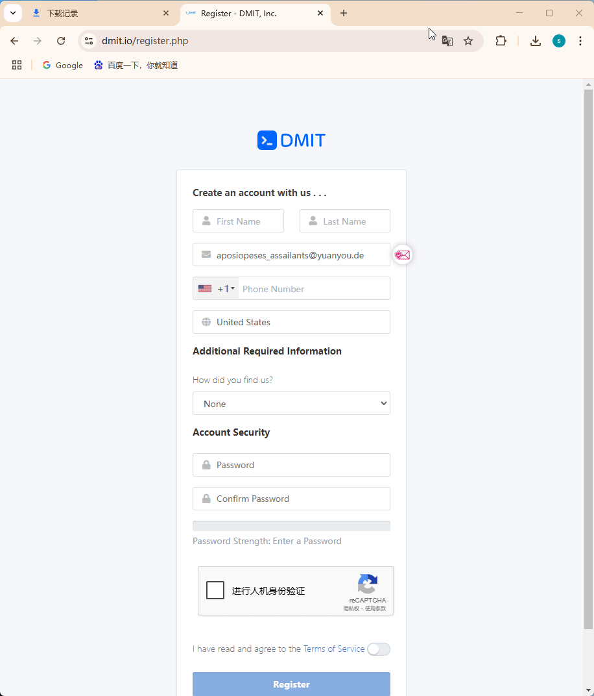
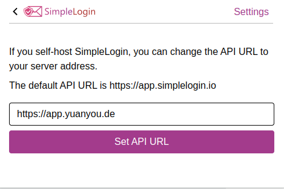
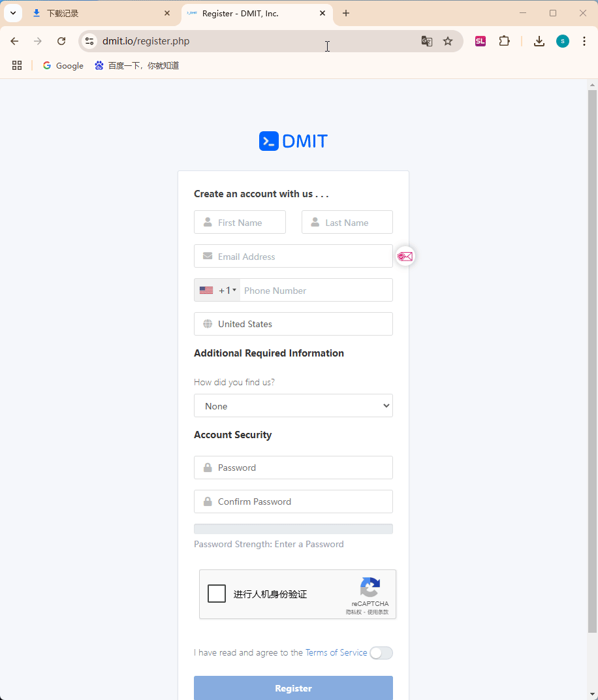
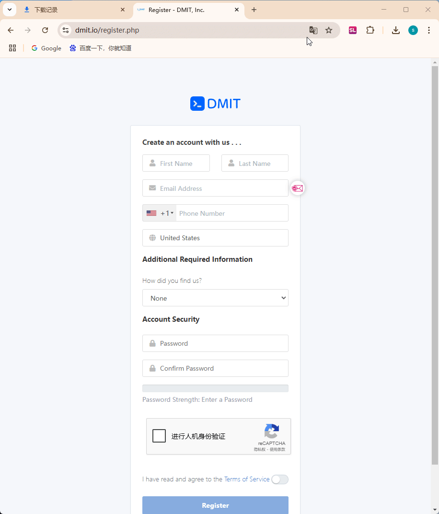

# 原邮邮箱 - 可以 push 的邮箱。 浏览器插件对接网站教程

## 第一步：下载并安装 simplelogin 官方的浏览器插件

1.下载并安装插件
[https://chromewebstore.google.com/detail/simpleloginreceive-send-e/dphilobhebphkdjbpfohgikllaljmgbn?pli=1](https://chromewebstore.google.com/detail/simpleloginreceive-send-e/dphilobhebphkdjbpfohgikllaljmgbn?pli=1)
2.将浏览器插件固定，方便后续使用

## 第二步：设置插件的API

> 不要登陆，设置插件的API，如果你已经登陆上了，需要退出，  

1. 在登陆界面点击 Settings，
2. 在API设置界面填入`https://app.yuanyou.de`，然后点击 Set API URL
3. 然后你就可以登陆了

步骤：

## 第三步：插件使用

> 登陆上之后，推荐先设置一下，点击小齿轮，然后两个选项都打开
第一个选项的意思是在需要登陆的EMAIL旁边生成一个simplelogin的图标，  
点一下直接就能创建一个别名
第二个选项的意思是，把simplelogin的图标放在输入框外面。  
（为了防止和一些密码管理软件冲突）

都设置好之后，有两种快速生成别名的方式

1. 比如打开一个你需要注册的网站，打开注册页面后，点击右上角的浏览器插件，插件会自动检测你需要注册的网站，给你填好别名，直接点 `Create` 创建就好了，然后把创建的别名复制一下，填到要注册的网站上。
2. 也可以直接点邮箱旁边儿的图标。这样创建的别名是随机的，但是会在 别名笔记 里填上使用这个别名的网站。

> 这就是两种生成方式  
如果你不喜欢完全随机别名，也可以把浏览器插件设置里的这两项取消掉。  
这样在邮件输入框就没有simplelogin的图标了。

