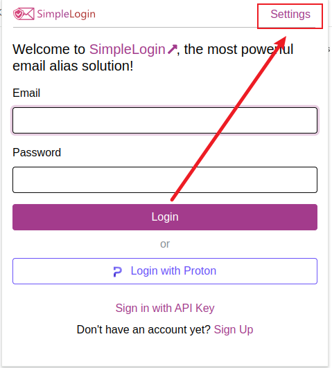

# 原邮邮箱 - 可以 push 的邮箱。 浏览器插件对接网站教程

## 第一步：下载并安装 simplelogin 官方的浏览器插件

[https://chromewebstore.google.com/detail/simpleloginreceive-send-e/dphilobhebphkdjbpfohgikllaljmgbn?pli=1](https://chromewebstore.google.com/detail/simpleloginreceive-send-e/dphilobhebphkdjbpfohgikllaljmgbn?pli=1)

## 第二步：设置插件的API

> 不要登陆，设置插件的API，如果你已经登陆上了，需要退出，  

1. 在登陆界面点击 Settings，
2. 在API设置界面填入 <https://app.yuanyou.de>，然后点击 Set API URL
3. 然后你就可以登陆了

步骤：

## 第三步：插件使用

1. 登陆上之后，推荐先设置一下，点击小齿轮，然后两个选项都打开
第一个的意思是在需要登陆的EMAIL旁边生成一个simplelogin的图标，点一下直接就能创建一个别名
第二个选项的意思是，把simplelogin的图标放在输入框外面。（为了防止和一些密码管理软件冲突）
2.
