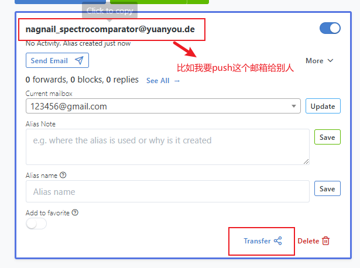
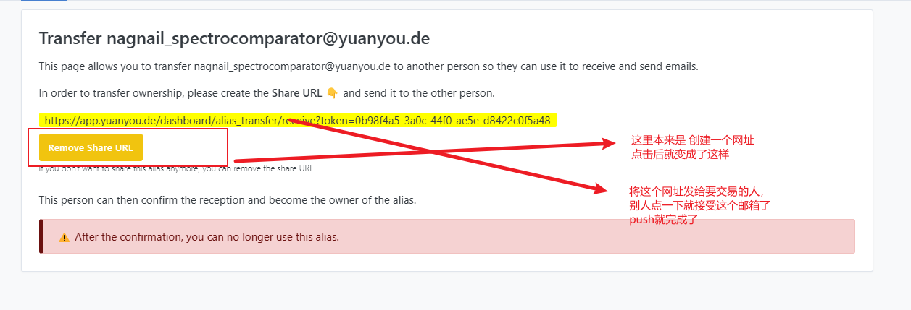

# app.yuanyou.de 使用教程

## 基础功能使用教程，更高阶的使用方法编写中

有小伙伴想要一个使用教程，这里简单说一下基础功能的使用方法
主要四个板块

1. 新建别名
2. 收信
3. 发信
4. push 别名邮箱

## 新建别名

每次你想要注册一个网站时，就可以点击顶层菜单 Aliases (别名) -> New Custom Alias (新建自定义别名)  
输入一个想要的名字，选择一下转发的邮箱，就会生成一个邮箱地址。

> 例子：  
> 我输入了 ceshi，选择了我的真实邮箱 xxxx@gmail.com。  
> 点击创建就会生成一个 ceshi.mammocks@yuanyou.de,  
> 这样之后，每次 ceshi.mammocks@yuanyou.de 收到邮件，就会自动转发到我的 gmail

> 推荐做法：  
> 你可以将它设置成你想要注册的网站的服务 比如 bwg 就会生成 bwg.frises@yuanyou.de

你也可以点击 Random Alias（随机别名） 来快速生成一个邮箱，

> 比如我点击了一下就生成了：barathron_mottler@yuanyou.de

**另外需要注意的是，每个别名邮箱，**  
**都可以指定 Alias Note（别名记录）和 Alias Name (别名名称) 来简单说明你为什么创建了这个别名，**  
**这是为了方便你区分大量的别名邮箱都是用作什么服务的。**

## 收件

你可以在顶层菜单中找到 MailBoxes, 这是用来设置你的真实邮箱的，
也就是别名邮箱具体将邮件转发到哪里。

在创建别名时 或者 去到 Aliases 页面，你可以设置 别名 收到邮件后，要转发到的真实邮箱。

> 1. 你必须在 MailBoxes 有两个及以上的邮箱，才可以在每个别名邮箱 -> More 中找到 Current mailbox 来修改收件的真实邮箱

> 2. 你可以设置默认的收件箱，可以在每次创建别名时，可以节省一步操作，不用额外选择收件箱。

## 发件

如果你需要回复你注册的网站给你发的邮件，可以在每个别名邮箱下，点击 Send Email 的选项  
然后输入一个邮箱地址，然后点击 Create reverse-alias (创建反向别名)  
创建成功后，你可以点击 Copy reverse-alias，然后就复制了一个反向别名邮箱地址。  
然后回到自己的真实邮箱，收件人填写这个反向别名地址就行了。

简述

1. 根据收件邮箱地址，创建反向别名，然后复制这个邮箱地址
2. 用真实邮箱给这个邮箱发信，就会自动转发到你第一步输入的邮箱

## push 邮箱

如果你需要交易小鸡，可以直接把这个别名邮箱 push 给别人，这样他就拥有原邮了。

### ! 严重警告

> **如果交易，请认准 yuanyou.de 后缀的邮箱**  
> 因为别人可以把域名接入我的平台，获得自定义邮箱，比如 xxxx@domain.com  
> 他也可以把域名撤出，不接入我的平台，这样就可以收回 push 的邮箱。  
> 我随后会开发，禁止掉自定义域名的别名邮箱可以 push 的操作。  
> 你要是想自己使用，那可以顺利的收发邮件，但是不能 push 自定义域名的别名邮箱。

### push 邮箱的步骤

要 push 的别名邮箱 -> More -> 点击 Transfer (转移，也就是 push)  
跳转至新页面之后，点击 Create Share URL (创建转移地址)  
就生成了一串网址，把网址发给别人，他访问一下，PUSH 就完成了。

简述：

1. 点击 transfer
2. 点击生成网址
3. 把网址发给买方。
4. 买方点击网址，push 完成。

> **如果交易取消了，在发给他网址之前，点击 Remove Share URL ，就可以取消 push 操作了**  
> **如果你已经将 URL 发给别人了，那别人访问一下，别名就转移走了。无法再取消。**  
> **请确保已经收到钱了，再给别人网址。**

~~**这里我又想到一个使用 yuanyou.de 的好处。**  
如果你能提供足够的证据，  
确认是被骗了，我可以帮忙把 PUSH 的邮箱再给你转移回去，让骗子无法得手。  
但是前提是，商家支持原邮跟客服对线。  
这样可以同时保证买方和卖方的权益。  
卖方收了钱不 push？让我来操作帮他 push，  
买方收了 push 不付钱，我再把邮箱 push 回卖方。~~

我想了想，我还是不能当法官，太多能扯皮的事了，这项取消。

