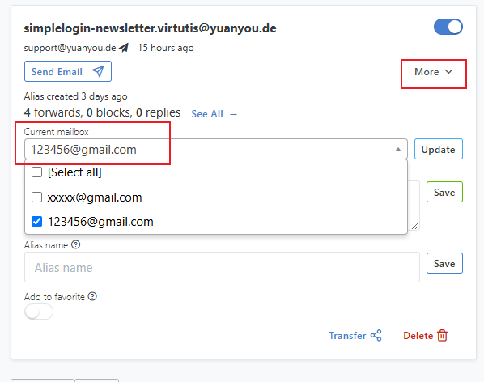
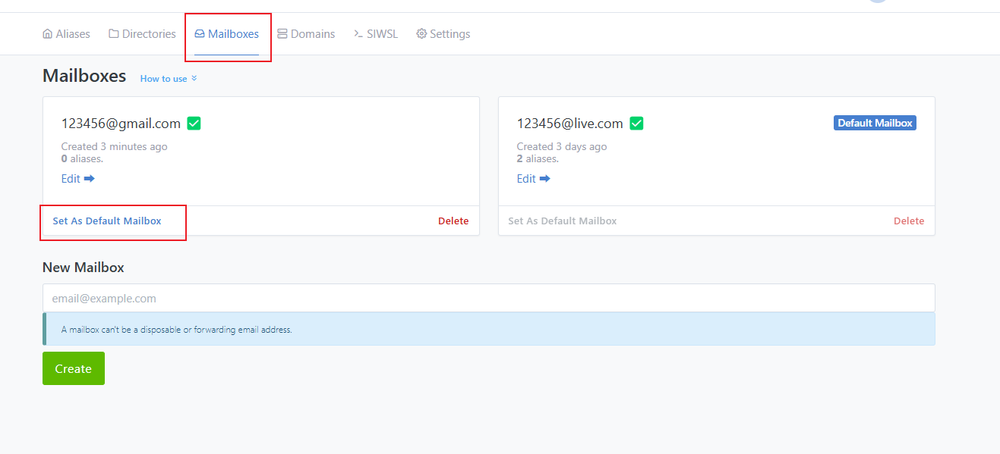
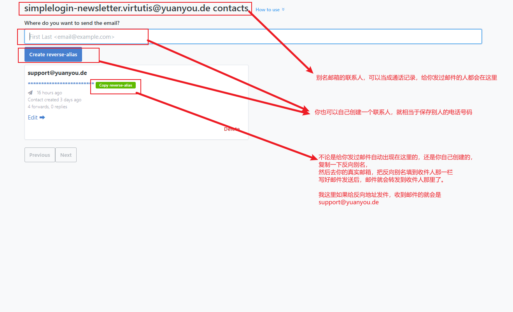

# app.yuanyou.de 使用教程 - v2025.3.2

## 新建别名

每次你想要注册一个网站时，就可以点击顶层菜单 Aliases (别名) -> New Custom Alias (新建自定义别名)  
输入一个想要的名字，选择一下转发的邮箱，就会生成一个邮箱地址。

> 例子：  
> 我输入了 ceshi，选择了我的真实邮箱 xxxx@gmail.com。  
> 点击创建就会生成一个 ceshi.mammocks@yuanyou.de,  
> 这样之后，每次 ceshi.mammocks@yuanyou.de 收到邮件，就会自动转发到我的 gmail

> 推荐做法：  
> 你可以将它设置成你想要注册的网站的服务 比如 bwg 就会生成 bwg.frises@yuanyou.de

你也可以点击 Random Alias（随机别名） 来快速生成一个邮箱，

> 比如我点击了一下就生成了：barathron_mottler@yuanyou.de

**另外需要注意的是，每个别名邮箱，**  
**都可以指定 Alias Note（别名记录）和 Alias Name (别名名称) 来简单说明你为什么创建了这个别名，**  
**这是为了方便你区分大量的别名邮箱都是用作什么服务的。**

## 收件

你可以在顶层菜单中找到 MailBoxes, 这是用来设置你的真实邮箱的，
也就是别名邮箱具体将邮件转发到哪里。

在创建别名时或者 Aliases 页面，你可以设置要别名收到邮件后要转发到的你真实的邮箱。

> 1. 你必须在 MailBoxes 有两个及以上的邮箱，才可以在每个别名邮箱 -> More 中找到 Current mailbox 来修改收件的真实邮箱

> 2. 你可以设置默认的收件箱，可以在每次创建别名时，可以节省一步操作，不用额外选择收件箱。

## 发件

如果你需要回复你注册的网站给你发的邮件，可以在每个别名邮箱下，点击 Send Email 的选项  
然后输入一个邮箱地址，然后点击 Create reverse-alias (创建反向别名)  
创建成功后，你可以点击 Copy reverse-alias，然后就复制了一个反向别名邮箱地址。  
然后回到自己的真实邮箱，收件人填写这个反向别名地址就行了。

简述

1. 根据收件邮箱地址，创建反向别名，然后复制这个邮箱地址
2. 用真实邮箱给这个邮箱发信，就会自动转发到你第一步输入的邮箱

